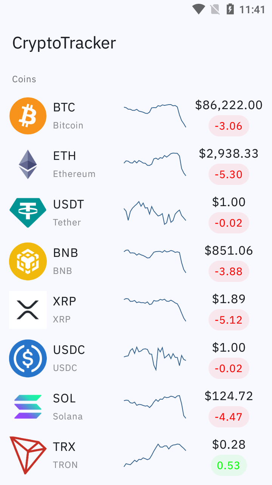
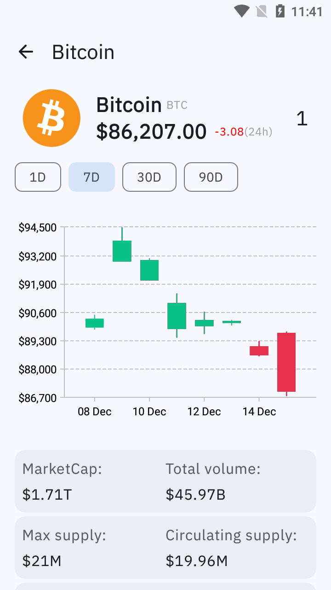

# CryptoTracker 🪙

[](https://kotlinlang.org/)
[](https://developer.android.com/jetpack/compose)
[](https://insert-koin.io/)

A robust, production-ready cryptocurrency tracking application built with **Jetpack Compose**. This project demonstrates modern Android development practices, focusing on scalability, testability, and a reactive user interface.

---

## 📱 App Preview

<p align="center">
  
  
</p>

> **Note:** The UI follows a modern **Squircle** design language with a refined dark-mode palette.

---

## 🚀 Key Features
- **Real-time Market Data**: Track top cryptocurrencies with live updates via CoinGecko API.
- **Interactive OHLC Charts**: Visualize price history with customizable time ranges (1D, 7D, 30D, 90D).
- **Advanced Pagination**: Custom implementation for seamless infinite scrolling and memory management.
- **Detailed Insights**: Comprehensive metrics including Market Cap, Total Volume, and Supply data.
- **Offline Awareness**: Robust connectivity handling with custom error states.

## 🏗 Architecture & Design Patterns
The project is built on **Clean Architecture** principles, ensuring a strict separation of concerns.

* **MVI (Model-View-Intent)**: Ensures a unidirectional data flow and predictable state management.
* **Dependency Injection**: Powered by **Koin**, providing a lightweight and pragmatic approach to DI.
* **UI Framework**: 100% **Jetpack Compose** with custom **Squircle** shapes and minimal design.
* **Networking**: **Ktor Client** for type-safe and efficient API communication.
* **Precision Handling**: Uses `BigDecimal` for all financial calculations.

## 🛠 Tech Stack
- **Kotlin**: Coroutines, Flow, Serialization.
- **Koin**: Dependency Injection.
- **Jetpack Compose**: Declarative UI.
- **Ktor**: Networking and API interaction.
- **Glide**: Image loading.

## 📂 Project Structure
```text
af.amir.cryptotracker
├── core
│   ├── data           # Shared network logic & safe API call wrappers
│   ├── domain         # Common models, Result types & Error handling
│   └── presentation   # UI Utilities, Formatters & Common components
├── crypto
│   ├── data           # DTOs, Mappers & Repository implementations
│   ├── domain         # Use cases, Repository interfaces & Business models
│   └── presentation   # MVI logic (ViewModels, States, Actions) & Compose UI
```


## 🛠️ Setup & Installation

Follow these steps to get the project up and running on your local machine:

### 1. Prerequisites
* **Android Studio Ladybug** (or newer)
* **JDK 17** or higher
* **Kotlin 1.9.x**

### 2. Clone the Repository
```bash
git clone https://github.com/amirr-sharifi/CryptoTracker-JetpackCompose.git
